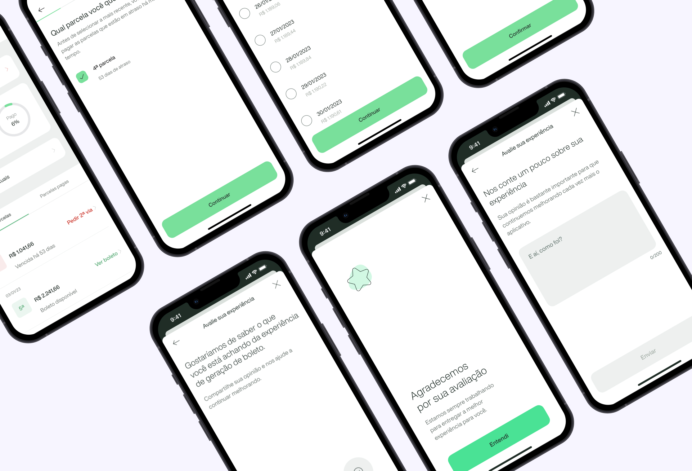

## Problem
Customers request loans using their car or house as collateral to achieve their goals, but they don’t always manage to keep up with their payments and may fall behind. One way to make loan payments is through the app. When we conducted a **funnel analysis** on the generation of payment slips for customers who were **30 to 60 days late**, we identified that **40% of these users did not proceed past the due date selection screen**.

## Goals
Without knowing the reason behind this behavior, we decided to implement a **Customer Satisfaction Score (CSAT) flow** to collect feedback from these users and define action plans to address any issues and improve their experience.

This survey would be triggered at two key moments: **On the due date selection screen**, where the highest drop-off occurred and after **the payment slip was successfully generated**.

To avoid overwhelming users, the survey would only appear for the same user **every 90 days**.

## Results
After a month of research, we gathered **574 responses**: 
- **88% from users who completed the process.** 
- **12% from users who abandoned before payment slip generation.**

### Completed Flow
Among users who successfully generated the payment slip:
- **78% approved** the experience, with comments such as:
    - _"Great experience."_
    - _"Intuitive and efficient app."_
    - _"I like that I don’t need to call."_
    - _"I appreciated being able to choose the due date."_
  
- **22% disapproved**, with comments including:
    - _"Interest rates are too high."_
    - _"More payment options needed."_
    - _"Delay in generating the payment slip within the app."_
    - _"Issues with customer service."_

### Dropped Flow
Among users who did not complete the payment process:
- **28% approved** the experience, with comments such as:
  - _"Very good."_
  - _"It’s practical to get the payment slip without having to talk to anyone."_
  - _"The app is getting simpler every day."_
  
- **72% disapproved**, citing issues such as:
  - _"Interest rates are too high."_
  - _"Abusive interest rates."_
  - _"I need a discount on my payment."_
  - _"Very difficult to find what I need."_
  - _"Trying to negotiate but not getting assistance."_
  - _"Payment slip not loading, had to request it through WhatsApp."_

<!--  -->

<video autoplay muted loop playsinline>
  <source src="../assets/images/cases/csat-flow-lavender.mp4" type="video/mp4">
</video>

## Takeaways
Our initial hypothesis was confirmed: **one major reason for drop-off on the due date selection screen is the high total amount due, driven by interest rates**. Users often simulate the payment but abandon the process before completing it.

Additionally, we identified a **delay in processing and/or displaying the payment slip** within the app. However, the feedback alone did not clarify the root cause of the problem, highlighting the need for user interviews to investigate further.

This was a **continuous analysis project** — every month, we reviewed user feedback and implemented improvements to enhance the experience.