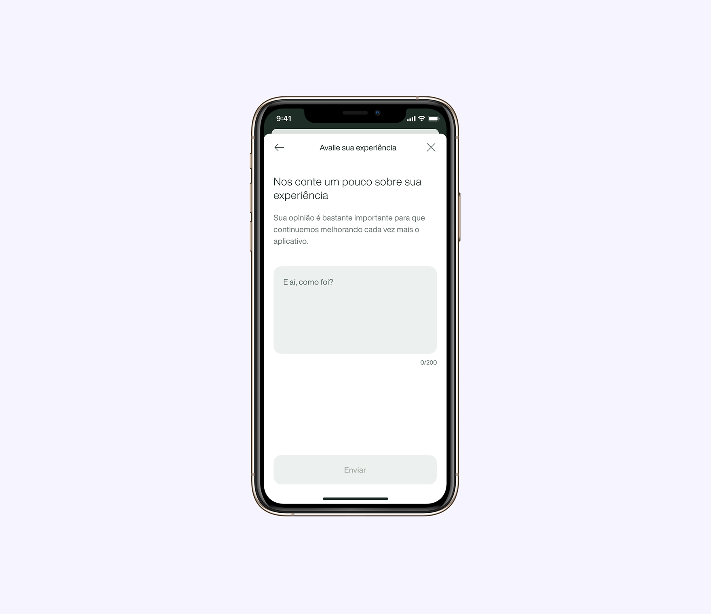

## Problem
Customers request loans with their car or house as collateral to achieve their goals, but they don't always manage to keep up with their payments and fall behind.
One way to make loan installments is through the app, and when we conducted a funnel analysis on generating payment slips for customers who are 30 to 60 days late, **we identified that 40% of these users didn't get past the due date selection screen.**

## Goals
Without knowing the reason behind that behavior, we decided to include a Customer Satisfaction Score (CSAT) flow to collect feedback from these users and action plans to deal with any issues and improve the experience of these customers.

This flow would appear at two moments: the first being on the screen where the drop was occurring, and the second after the completion of the payment slip. This survey would appear for the same user every 90 days.

## Results
After a month of research, we had **574 responses: 88% from users who completed the request and 12% from users who dropped the flow.**

### Completed Flow
In the completed flow, we had **78% of approval**, with comments such as: “great experience”, “intuitive and efficient app”, “great that I don't need to call”, “I liked being able to choose the due date” and others.
We had **22% responses that disapproved the experience**, with comments like: “very high interest rates”, “more payment options”, “delay in generating the payment slip within the app”, and “problems with customer service”.

### Dropped Flow
In case of the users who did not complete the payment journey, we only had **28% of approval**, with comments such as: “very good”, “practical to get the payment slip without having to talk to anyone” and “the app is getting simpler every day”.
We had **72% of people disapproving the journey**, with comments like: “very high interest rates”, “abusive interest rates”, “need a discount on payment”, “very difficult to find what I need”, “trying to negotiate and not being attended to”, “not loading the payment slip and need to request it through WhatsApp”. 

<!--  -->

<video autoplay muted loop playsinline>
  <source src="../assets/images/cases/csat-flow.mp4" type="video/mp4">
</video>

## Takeaways
According to our initial hypothesis, one of the reasons for the drop on the due date selection screen is the amount to be paid being too high due to the interest rate. Users tend to simulate payment, but give up before completing the process.

We also discovered an issue about a delay in processing and/or displaying the bill within the app. Only based on the comments received, we were unable to identify the source of the problem, making it necessary to interview users to understand the issue in more depth.

This was a continuous analysis project. Every month we analyzed the comments and made improvements to this flow.