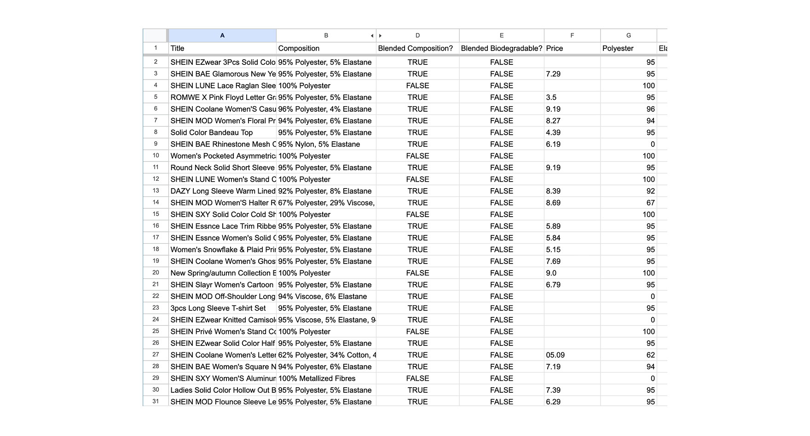
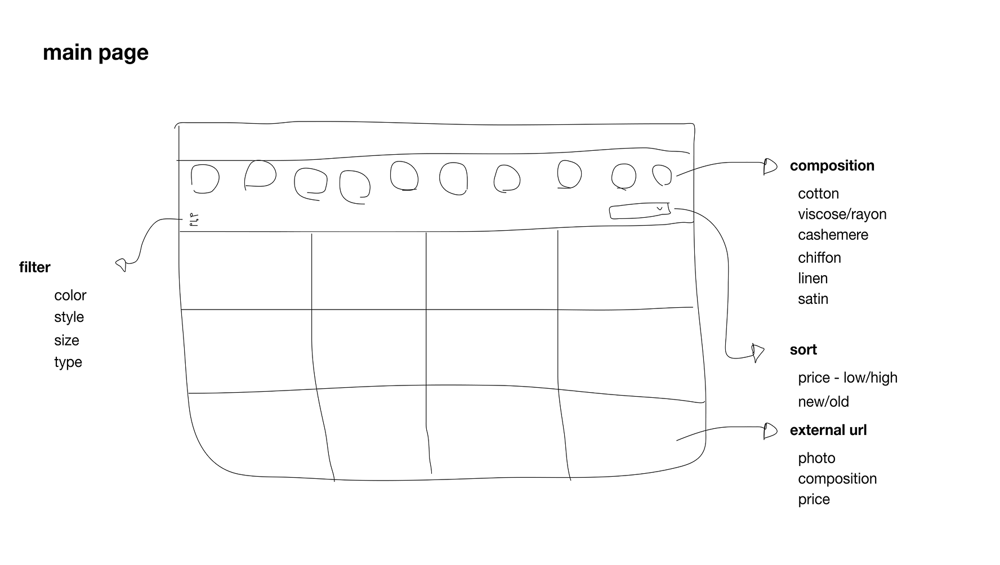

<!-- - Timeline
  - Jan, 2024

- Disciplines
  - Design
  - Data

- Responsibilities
  - Data Analysis
  - Design Thinking
  - Wireframing
  - UI Design

- Team
  - Designer (Mariana)
  - Developer (Vinicius)

- Tools
  - Google Sheets
  - Figma
  - Python
  - Svelte -->

## Context

I’ve always liked buying clothes from SHEIN. It’s an affordable way to purchase different pieces, but one thing has always bothered me: the material.

To keep prices low, SHEIN’s clothes don’t have long durability. After a few washes, items often develop pilling or fade. So, I decided to change my wardrobe.

## Problem

In search of fresher and more durable pieces, I looked for more natural fabrics on the website. That’s when I realized I couldn’t filter products properly. Neither the website nor the app offered a dedicated filter for fabric composition. While they do allow filtering by material, "material" and "composition" aren’t always the same thing.

The truth is, SHEIN has such an extensive catalog that categorization has become somewhat inconsistent over time. Additionally, I noticed that finding natural materials was difficult, as the majority of items were made of polyester.

And in these searches, I came up with **two hypotheses**: the first was that I thought **at least 90% of the clothes from SHEIN were made from plastic derivatives** – polyester, polyamide, etc., and the second was that **the company didn’t seem very willing to showcase pieces made from natural materials**, as the vast majority weren't made from these materials.

## Goals
The challenge was to create an experience where users could filter SHEIN pieces by biodegradable fabric composition. Additionally, I saw an opportunity to present data on the number of biodegradable items available and the time required to find them on the website.

<!-- <video autoplay muted loop playsinline>
  <source src="../assets/images/cases/the-composition.mp4" type="video/mp4">
</video> -->

<!-- - 
---
- *Desafio* Criar um site onde fosse possível filtrar as peças da SHEIN por composição de tecidos biodegradáveis.
- *Oportunidade* Exibir dados de quantas de peças que são biodegradáveis e quanto tempo o usuário precisaria procurar no site para ter acesso a essas roupas.
-->

<!-- - 1. Discover
  - Identify Problem
  - Data Analysis
1. Define
  - Solution Ideation
  - Low Fidelity
1. Develop
  - Final Design

-->

## Process

### *Discover* Searching for answers

Considering my hypotheses, I decided to go after answers. With a website that has approximately 600,000 items for sale (according to [BBC](https://www.bbc.com/news/articles/cp991n2v0m2o 'The rise and rise of fashion giant Shein on BBC Article')), it became unfeasible to analyze all the clothes, so I needed a sample that would represent the whole. In this case, I selected a base from the ‘Best-Selling Women’s Clothes – Tops, Blouses, and T-shirts’ page. I chose this segment because, although SHEIN didn’t release a report on the best-selling items, I analyzed which pieces appeared most frequently as ‘Best-Selling’ and concluded that it was women’s tops.

Together with Vini (front-end developer), we scraped data from the selected sample. After obtaining the .csv file, I exported it to Google Sheets for analysis.

### Sample analyzed

After reviewing the data, I was able to confirm some of my hypotheses and uncover additional insights: **Over 90% of the clothes are made of polyester.**

Additionally, I noticed that it was more common to find a blend of materials, so to be more precise, **95% of the clothes are made of a combination of polyester and elastane.**

Finding biodegradable pieces was extremely difficult—on average, a user would take **about 2 hours to find just 8 items.**

### *Define* Brainstorming a solution

So, with relevant data in hand, it was now time to think of a solution. My objectives were to make it easier to find these biodegradable pieces and to bring a reflection on the data used, such as insights into how SHEIN produces its clothes and how difficult it is to access natural pieces.

I decided to create a website inspired by clothing composition labels, where users could filter garments by specific materials and access general data about fabric compositions.

### *Develop* Final delivery

<video autoplay muted loop playsinline>
  <source src="../assets/images/cases/composition-final.mp4" type="video/mp4">
</video>

[Check it live](https://thecompositionlabel.com/)